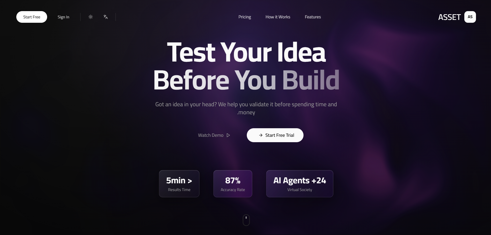
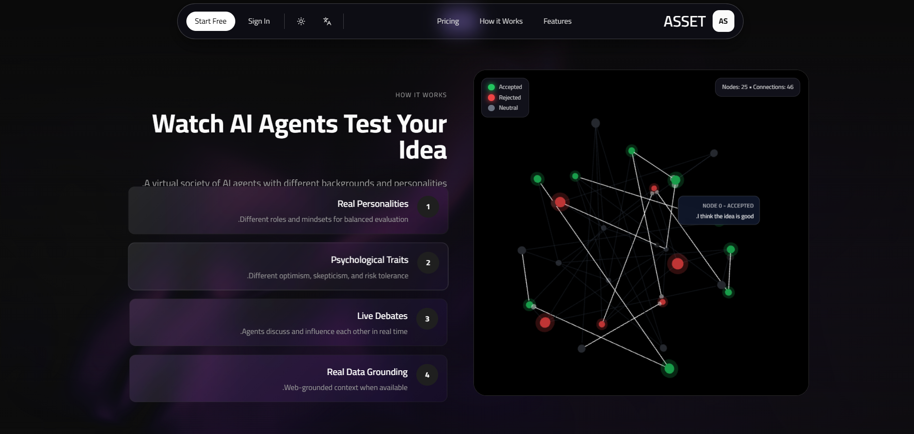
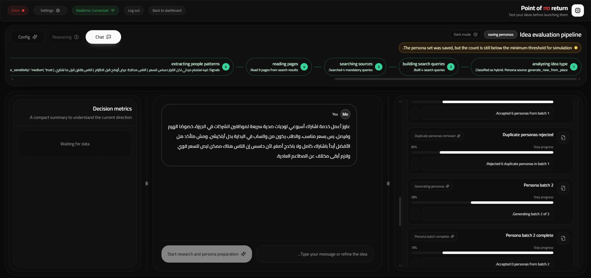
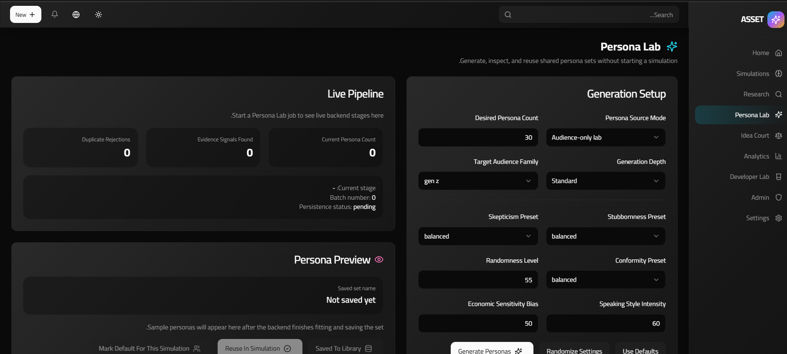

# AgenticAI Community Simulator

A full-stack platform for running AI-driven community simulations around product ideas, market behavior, and decision-making scenarios. The project combines a FastAPI backend, a React + Vite frontend, live WebSocket updates, and supporting workflows such as research, idea court, and persona exploration.

## Overview

AgenticAI Community Simulator helps teams move beyond static brainstorming. Instead of evaluating an idea in isolation, the system creates a simulated environment where multiple AI agents react, debate, influence each other, and surface signals that are useful for validation.

Core experience:

- Launch guided simulations around a business idea or scenario
- Stream live simulation events over WebSockets
- Explore research-backed context before or during a run
- Evaluate ideas through dedicated court and persona workflows
- Manage users, credits, and platform settings from admin tooling

## Product Screenshots

<p align="center">
  
  
</p>
<p align="center">
  
  
</p>

## Key Capabilities

- Multi-agent simulation engine with REST and WebSocket support
- Guided workflow for simulation setup, clarification, approval, pause, and resume
- Research module for gathering market context before execution
- Idea Court flow for structured evaluation of a concept
- Persona Lab for persona-driven simulation jobs and reusable persona sets
- Authentication system with email verification, password reset, and optional Google login
- Admin endpoints for usage, credits, billing, roles, and promo controls
- Frontend dashboard with simulation views, reasoning panels, search, and analytics-oriented UI

## Tech Stack

**Backend**

- FastAPI
- MySQL
- WebSockets
- Python-based dataset and simulation orchestration

**Frontend**

- React 18
- Vite
- TypeScript
- Tailwind CSS
- Radix UI
- React Query
- Recharts

## Getting Started

### Prerequisites

- Python 3.10+
- Node.js 18+
- MySQL or MariaDB

### 1. Backend setup

```powershell
python -m venv .venv
.\.venv\Scripts\activate
pip install -r requirements.txt
Copy-Item backend\.env.example backend\.env
```

### 2. Create the database

Create a database named `agentic_simulator`, then apply the schema from:

```text
backend/app/core/db_schema.sql
```

Update `backend/.env` if your local MySQL credentials differ from the example file.

### 3. Start the backend

From the repository root:

```powershell
.\.venv\Scripts\python.exe -m uvicorn backend.app.main:app --host 127.0.0.1 --port 8000 --reload
```

FastAPI docs will be available at:

- `http://127.0.0.1:8000/docs`
- `http://127.0.0.1:8000/redoc`

### 4. Frontend setup

```powershell
Set-Location frontend
npm install
npm run dev
```

The frontend expects these values in `frontend/.env`:

```env
VITE_API_URL=http://localhost:8000
VITE_WS_URL=ws://localhost:8000
VITE_GOOGLE_CLIENT_ID=
```

## Testing

### Frontend unit tests

```powershell
Set-Location frontend
npm test
```

### Frontend lint

```powershell
Set-Location frontend
npm run lint
```

### Selenium smoke test

Smoke coverage lives in `tests/selenium_smoke.py`.

```powershell
python tests\selenium_smoke.py
```

Configurable environment variables include:

- `BROWSER=chrome|firefox`
- `DRIVER_PATH=path\to\driver.exe`
- `CHROME_BINARY=path\to\chrome.exe`
- `FIREFOX_BINARY=path\to\firefox.exe`
- `WINDOW_SIZE=1400,900`
- `HEADLESS=1|0`
- `TIMEOUT=25`
- `SCREENSHOT_DIR=path\to\screenshots`

Note: `selenium` is used by the smoke test but is not currently listed in `requirements.txt`.

## Project Structure

```text
.
|- backend/      FastAPI app, simulation engine, auth, research, court, admin, persona workflows
|- frontend/     React + Vite application
|- tests/        Selenium smoke coverage
|- Screenshots/  README gallery assets
```

## Configuration Notes

- `backend/.env.example` includes MySQL settings, JWT config, daily limits, and bootstrap accounts.
- On backend startup, the application initializes the database connection and bootstraps default users based on environment variables.
- CORS is preconfigured for common local development ports such as `3000`, `5173`, and `8080`.

## Useful Files

- `backend/app/main.py`
- `backend/app/core/db_schema.sql`
- `backend/.env.example`
- `frontend/.env`
- `tests/selenium_smoke.py`

